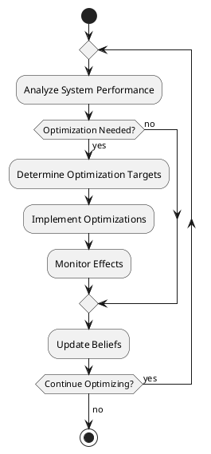

# Docs: Optimization Agent

The OptimizationAgent focuses on optimizing system performance and resource utilization. It uses various algorithms to improve efficiency, ensuring that the MAS operates at optimal performance levels.

Here is detailed documentation for implementing the Optimization Agent, including its role, BDI components, and how it fits into the goal-oriented business development and operation multi-agent system SaaS platform.

## Role and Purpose:

The Optimization Agent is responsible for continuously analyzing the system's performance and resource utilization, identifying areas for improvement, and implementing optimizations. It plays a crucial role in maintaining the efficiency and scalability of the multi-agent system by ensuring that resources are used optimally and performance bottlenecks are addressed proactively.

### BDI Components:

### a. Beliefs:

- Current system state (CPU usage, memory usage, response times, throughput, etc.)
- Historical performance data
- Optimization targets and strategies
- Resource allocation policies
- System configuration parameters

### b. Desires:

- Maintain optimal system performance
- Efficiently utilize system resources
- Reduce response times and increase throughput
- Proactively address potential performance bottlenecks
- Balance resource allocation across the system

### c. Intentions:

- Analyze system performance regularly
- Identify areas needing optimization
- Determine optimal resource allocation
- Implement performance improvements
- Monitor the effects of applied optimizations

### Goals:

- G1: Optimize System Performance (Maintain goal)
- G2: Optimize Resources (Achieve goal)
- G3: Process Optimization Requests (Achieve goal)

### Plans:

- P1: AnalyzePerformancePlan
- P2: OptimizeResourcesPlan
- P3: ImplementOptimizationsPlan

### Actions:

- Collect and analyze system performance metrics
- Determine optimization targets based on current system state
- Calculate optimal resource allocation
- Apply optimization strategies (e.g., scaling, load balancing)
- Adjust system configuration parameters
- Monitor the impact of applied optimizations
- Respond to optimization requests from other agents

### Knowledge:

- Performance optimization algorithms and techniques
- Resource allocation strategies
- System scalability patterns
- Performance bottleneck identification methods
- Correlation between different system metrics and overall performance
- Machine learning models for predictive optimization

### PlantUML Diagrams:

### a. Workflow Diagram:

```
@startuml
|Optimization Agent|
start
repeat
  :Analyze System Performance;
  if (Optimization Needed?) then (yes)
    :Determine Optimization Targets;
    :Implement Optimizations;
    :Monitor Effects;
  else (no)
  endif
  :Update Beliefs;
repeat while (Continue Optimizing?) is (yes)
-> no;
stop
@enduml

```

```python
from pade.core.agent import Agent
from pade.acl.messages import ACLMessage
from pade.misc.utility import display_message
from models.goal_model import Goal
from models.belief_model import Belief
from models.plan_model import Plan
import asyncio

class OptimizationAgent(Agent):
    def __init__(self, aid):
        super(OptimizationAgent, self).__init__(aid)
        self.beliefs = []
        self.goals = []
        self.plans = []
        self.system_state = {}
        self.optimization_targets = {}

    def setup(self):
        display_message(self.aid.name, "Setting up OptimizationAgent")
        self.add_goal(Goal("OptimizeSystemPerformance", "Maintain"))
        self.add_plan(Plan("AnalyzePerformancePlan", self.analyze_performance))
        self.add_plan(Plan("OptimizeResourcesPlan", self.optimize_resources))
        self.add_plan(Plan("ImplementOptimizationsPlan", self.implement_optimizations))

    async def act(self):
        display_message(self.aid.name, "Acting in OptimizationAgent")
        await self.execute_plans()

    def on_message(self, message: ACLMessage):
        display_message(self.aid.name, f"Received message: {message.content}")
        if message.performative == ACLMessage.REQUEST:
            self.handle_optimization_request(message)

    def add_goal(self, goal):
        self.goals.append(goal)

    def add_belief(self, belief):
        self.beliefs.append(belief)

    def add_plan(self, plan):
        self.plans.append(plan)

    async def execute_plans(self):
        for plan in self.plans:
            if plan.is_applicable(self.beliefs, self.goals):
                await plan.execute()

    async def analyze_performance(self):
        display_message(self.aid.name, "Analyzing system performance")
        # Simulated performance analysis
        self.system_state = {
            "cpu_usage": 75,
            "memory_usage": 80,
            "response_time": 150,  # ms
            "throughput": 1000  # requests/second
        }
        self.add_belief(Belief("SystemState", self.system_state))
        if self.needs_optimization(self.system_state):
            self.add_goal(Goal("OptimizeResources", "Achieve"))

    async def optimize_resources(self):
        display_message(self.aid.name, "Optimizing system resources")
        current_state = self.beliefs.get("SystemState")
        if current_state:
            self.optimization_targets = self.determine_optimization_targets(current_state)
            self.add_belief(Belief("OptimizationTargets", self.optimization_targets))

    async def implement_optimizations(self):
        display_message(self.aid.name, "Implementing optimizations")
        optimization_targets = self.beliefs.get("OptimizationTargets")
        if optimization_targets:
            for target, action in optimization_targets.items():
                await self.apply_optimization(target, action)

    def handle_optimization_request(self, message):
        content = message.content
        # Logic to handle optimization requests from other agents
        self.add_belief(Belief("OptimizationRequest", content))
        self.add_goal(Goal("ProcessOptimizationRequest", "Achieve"))

    def needs_optimization(self, state):
        # Simulated optimization need determination
        return state["cpu_usage"] > 70 or state["memory_usage"] > 75 or state["response_time"] > 100

    def determine_optimization_targets(self, state):
        # Simulated optimization target determination
        targets = {}
        if state["cpu_usage"] > 70:
            targets["cpu"] = "scale_up"
        if state["memory_usage"] > 75:
            targets["memory"] = "increase_allocation"
        if state["response_time"] > 100:
            targets["application"] = "optimize_code"
        return targets

    async def apply_optimization(self, target, action):
        # Simulated optimization application
        display_message(self.aid.name, f"Applying {action} optimization to {target}")
        # Here you would typically send a message to other agents or systems to apply the optimization

    async def run(self):
        while True:
            await self.act()
            await asyncio.sleep(300)  # Optimize every 5 minutes

```

Now, I'll provide the documentation for this Optimization Agent:

```markdown
# Docs: The Optimization Agent

The OptimizationAgent focuses on optimizing system performance and resource utilization. It uses various algorithms to improve efficiency, ensuring that the MAS operates at optimal performance levels.

Here is detailed documentation for implementing the Optimization Agent, including its role, BDI components, and how it fits into the goal-oriented business development and operation multi-agent system SaaS platform.

# **Documentation**

## Role and Purpose:

The Optimization Agent is responsible for continuously analyzing the system's performance and resource utilization, identifying areas for improvement, and implementing optimizations. It plays a crucial role in maintaining the efficiency and scalability of the multi-agent system by ensuring that resources are used optimally and performance bottlenecks are addressed proactively.

### BDI Components:

#### a. Beliefs:
- Current system state (CPU usage, memory usage, response times, throughput, etc.)
- Historical performance data
- Optimization targets and strategies
- Resource allocation policies
- System configuration parameters

#### b. Desires:
- Maintain optimal system performance
- Efficiently utilize system resources
- Reduce response times and increase throughput
- Proactively address potential performance bottlenecks
- Balance resource allocation across the system

#### c. Intentions:
- Analyze system performance regularly
- Identify areas needing optimization
- Determine optimal resource allocation
- Implement performance improvements
- Monitor the effects of applied optimizations

### Goals:
- G1: Optimize System Performance (Maintain goal)
- G2: Optimize Resources (Achieve goal)
- G3: Process Optimization Requests (Achieve goal)

### Plans:
- P1: AnalyzePerformancePlan
- P2: OptimizeResourcesPlan
- P3: ImplementOptimizationsPlan

### Actions:
- Collect and analyze system performance metrics
- Determine optimization targets based on current system state
- Calculate optimal resource allocation
- Apply optimization strategies (e.g., scaling, load balancing)
- Adjust system configuration parameters
- Monitor the impact of applied optimizations
- Respond to optimization requests from other agents

### Knowledge:
- Performance optimization algorithms and techniques
- Resource allocation strategies
- System scalability patterns
- Performance bottleneck identification methods
- Correlation between different system metrics and overall performance
- Machine learning models for predictive optimization

### PlantUML Diagrams:

#### a. Workflow Diagram:



### b. Goal Model (Using Activity Diagram):

```
@startuml
|Optimization Agent|
start
fork
  :G1: Optimize System Performance;
fork again
  :G2: Optimize Resources;
fork again
  :G3: Process Optimization Requests;
end fork
stop
@enduml

```

### c. Sequence Diagram (Interaction with other agents):

```
@startuml
participant "Optimization Agent" as Opt
participant "Monitoring Agent" as Mon
participant "Resource Manager" as Res
participant "Application Agent" as App

loop Every optimization interval
    Mon -> Opt: Send performance metrics
    Opt -> Opt: Analyze performance
    alt Optimization needed
        Opt -> Opt: Determine optimization targets
        Opt -> Res: Request resource adjustment
        Res --> Opt: Confirm resource changes
        Opt -> App: Request application optimizations
        App --> Opt: Confirm optimizations applied
    end
end
Opt -> Mon: Report optimization actions
@enduml

```

### Detailed Code Explanation:

The provided code outlines the basic structure of the Optimization Agent. Here's a detailed explanation of its components:

1. **Initialization and Setup:**
    - The agent initializes with empty lists for beliefs, goals, and plans, and dictionaries for system state and optimization targets.
    - In the `setup` method, it adds an initial goal to optimize system performance and three plans: for analyzing performance, optimizing resources, and implementing optimizations.
2. **Action Execution:**
    - The `act` method is called periodically, executing the agent's plans based on its current beliefs and goals.
3. **Message Handling:**
    - The `on_message` method processes incoming messages, specifically handling optimization requests from other agents.
4. **Plan Execution:**
    - The `execute_plans` method iterates through all plans, executing those that are applicable given the current beliefs and goals.
5. **Performance Analysis:**
    - The `analyze_performance` method simulates the analysis of system performance, updating the agent's beliefs with the new data and potentially adding a goal to optimize resources.
6. **Resource Optimization:**
    - The `optimize_resources` method determines optimization targets based on the current system state.
7. **Optimization Implementation:**
    - The `implement_optimizations` method applies the determined optimizations to the system.
8. **Continuous Optimization:**
    - The `run` method implements a continuous optimization loop, periodically executing the agent's act method.

### Implementation Details:

To fully implement this agent, consider the following enhancements:

1. Implement real performance analysis mechanisms, integrating with system monitoring tools and performance profilers.
2. Develop more sophisticated optimization algorithms, potentially incorporating machine learning for predictive optimization.
3. Implement a wider range of optimization strategies for different types of resources and performance bottlenecks.
4. Add support for dynamic optimization thresholds that adapt based on historical data and system patterns.
5. Implement more detailed communication protocols with other agents (e.g., Resource Manager, Application Agents) for coordinated optimization efforts.
6. Develop a feedback mechanism to assess the effectiveness of applied optimizations over time.
7. Implement rollback capabilities for optimizations that don't yield the expected improvements.
8. Add support for custom optimization rules and priorities that can be defined by system administrators.

This implementation provides a foundation for the Optimization Agent, allowing it to continuously improve the performance and efficiency of the multi-agent system. The modular design allows for easy extension of its capabilities as the optimization requirements grow in complexity.

This documentation provides a comprehensive overview of the Optimization Agent, its role in the MABOS platform, and its implementation details. It covers the agent's BDI components, goals, plans, actions, and knowledge requirements. The included PlantUML diagrams illustrate the agent's workflow, goal model, and interactions with other agents. The detailed code explanation and implementation notes provide guidance for developers to implement and integrate this agent into the larger multi-agent system.