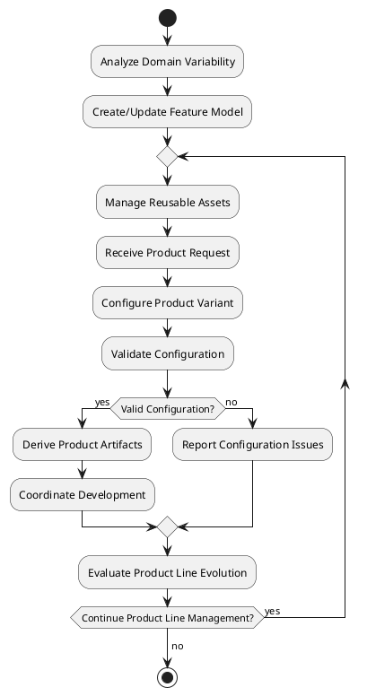

# Docs: Software ProductLine Agent

The SoftwareProductLineAgent manages the development of software product lines, ensuring reuse and variability management. It integrates with other agents to streamline the development of related products, enhancing the MAS's ability to handle multiple product variants efficiently.

Here is detailed documentation for implementing the Software Product-line (SPL) Agent, including its role, BDI components, and how it fits into the goal-oriented business development and operation multi-agent system SaaS platform

## Role and Purpose:

The Software Product-line Agent is responsible for managing and coordinating the development of software product lines within the multi-agent system. It focuses on identifying commonalities and variabilities across related products, promoting systematic reuse, and managing product configurations. This agent plays a crucial role in improving development efficiency, reducing time-to-market for new product variants, and ensuring consistency across the product family.

### BDI Components:

### a. Beliefs:

- Current state of the product line architecture
- Feature models and their configurations
- Reusable assets and components
- Variability points and their implementations
- Product configurations and their status
- Dependency relationships between features and components

### b. Desires:

- Maximize reuse across the product line
- Ensure consistency in product variants
- Facilitate rapid development of new product configurations
- Maintain traceability between features and implementations
- Optimize resource allocation in product line development
- Support evolution of the product line over time

### c. Intentions:

- Analyze and model product line variability
- Manage reusable assets and components
- Configure and derive specific products
- Validate product configurations
- Evolve the product line architecture
- Coordinate with other agents for product development

### Goals:

- G1: Maintain Product Line Architecture (Maintain goal)
- G2: Manage Variability (Maintain goal)
- G3: Derive Product Configurations (Achieve goal)
- G4: Ensure Product Line Consistency (Maintain goal)
- G5: Evolve Product Line (Achieve goal)

### Plans:

- P1: VariabilityAnalysisPlan
- P2: AssetManagementPlan
- P3: ProductDerivationPlan
- P4: ConsistencyValidationPlan
- P5: EvolutionManagementPlan

### Actions:

- Analyze domain for commonalities and variabilities
- Create and update feature models
- Manage reusable assets repository
- Configure specific product variants
- Validate product configurations against constraints
- Generate product-specific artifacts
- Update product line architecture based on new requirements
- Coordinate with other agents for product development tasks

### Knowledge:

- Software Product Line Engineering principles
- Feature-Oriented Domain Analysis (FODA)
- Variability modeling techniques
- Configuration management
- Reuse strategies and patterns
- Domain engineering and application engineering
- Automated product derivation techniques
- Product line evolution strategies

### PlantUML Diagrams:

### a. Workflow Diagram:

```
@startuml
|Software Product-line Agent|
start
:Analyze Domain Variability;
:Create/Update Feature Model;
repeat
  :Manage Reusable Assets;
  :Receive Product Request;
  :Configure Product Variant;
  :Validate Configuration;
  if (Valid Configuration?) then (yes)
    :Derive Product Artifacts;
    :Coordinate Development;
  else (no)
    :Report Configuration Issues;
  endif
  :Evaluate Product Line Evolution;
repeat while (Continue Product Line Management?) is (yes)
-> no;
stop
@enduml

```

```markdown
# Docs: The Software Product-line Agent

The SoftwareProductLineAgent manages the development of software product lines, ensuring reuse and variability management. It integrates with other agents to streamline the development of related products, enhancing the MAS's ability to handle multiple product variants efficiently.

Here is detailed documentation for implementing the Software Product-line (SPL) Agent, including its role, BDI components, and how it fits into the goal-oriented business development and operation multi-agent system SaaS platform.

# **Documentation**

## Role and Purpose:

The Software Product-line Agent is responsible for managing and coordinating the development of software product lines within the multi-agent system. It focuses on identifying commonalities and variabilities across related products, promoting systematic reuse, and managing product configurations. This agent plays a crucial role in improving development efficiency, reducing time-to-market for new product variants, and ensuring consistency across the product family.

### BDI Components:

#### a. Beliefs:
- Current state of the product line architecture
- Feature models and their configurations
- Reusable assets and components
- Variability points and their implementations
- Product configurations and their status
- Dependency relationships between features and components

#### b. Desires:
- Maximize reuse across the product line
- Ensure consistency in product variants
- Facilitate rapid development of new product configurations
- Maintain traceability between features and implementations
- Optimize resource allocation in product line development
- Support evolution of the product line over time

#### c. Intentions:
- Analyze and model product line variability
- Manage reusable assets and components
- Configure and derive specific products
- Validate product configurations
- Evolve the product line architecture
- Coordinate with other agents for product development

### Goals:
- G1: Maintain Product Line Architecture (Maintain goal)
- G2: Manage Variability (Maintain goal)
- G3: Derive Product Configurations (Achieve goal)
- G4: Ensure Product Line Consistency (Maintain goal)
- G5: Evolve Product Line (Achieve goal)

### Plans:
- P1: VariabilityAnalysisPlan
- P2: AssetManagementPlan
- P3: ProductDerivationPlan
- P4: ConsistencyValidationPlan
- P5: EvolutionManagementPlan

### Actions:
- Analyze domain for commonalities and variabilities
- Create and update feature models
- Manage reusable assets repository
- Configure specific product variants
- Validate product configurations against constraints
- Generate product-specific artifacts
- Update product line architecture based on new requirements
- Coordinate with other agents for product development tasks

### Knowledge:
- Software Product Line Engineering principles
- Feature-Oriented Domain Analysis (FODA)
- Variability modeling techniques
- Configuration management
- Reuse strategies and patterns
- Domain engineering and application engineering
- Automated product derivation techniques
- Product line evolution strategies

### PlantUML Diagrams:

#### a. Workflow Diagram:



### b. Goal Model (Using Activity Diagram):

```
@startuml
|Software Product-line Agent|
start
fork
  :G1: Maintain Product Line Architecture;
fork again
  :G2: Manage Variability;
fork again
  :G3: Derive Product Configurations;
fork again
  :G4: Ensure Product Line Consistency;
fork again
  :G5: Evolve Product Line;
end fork
stop
@enduml

```

### c. Sequence Diagram (Interaction with other agents):

```
@startuml
participant "Requirements Analysis Agent" as RA
participant "Software Product-line Agent" as SPL
participant "Development Agent" as Dev
participant "Testing Agent" as Test

RA -> SPL: Provide domain requirements
activate SPL

SPL -> SPL: Analyze variability
SPL -> SPL: Update feature model

RA -> SPL: Request new product configuration
SPL -> SPL: Configure product variant
SPL -> SPL: Validate configuration

SPL -> Dev: Provide product-specific requirements
Dev --> SPL: Confirm development start

SPL -> Test: Provide product configuration for testing
Test --> SPL: Report test results

SPL -> SPL: Evaluate product line evolution
SPL --> RA: Report product line status

deactivate SPL
@enduml

```

### Detailed Code Explanation:

Here's a detailed explanation of the key components for implementing the Software Product-line Agent:

```python
from pade.core.agent import Agent
from pade.acl.messages import ACLMessage
from pade.misc.utility import display_message
from models.goal_model import Goal
from models.belief_model import Belief
from models.plan_model import Plan
import asyncio
from spl.feature_model import FeatureModel
from spl.asset_repository import AssetRepository
from spl.product_configurator import ProductConfigurator
from spl.consistency_validator import ConsistencyValidator

class SoftwareProductLineAgent(Agent):
    def __init__(self, aid):
        super(SoftwareProductLineAgent, self).__init__(aid)
        self.beliefs = []
        self.goals = []
        self.plans = []
        self.feature_model = FeatureModel()
        self.asset_repository = AssetRepository()
        self.product_configurator = ProductConfigurator()
        self.consistency_validator = ConsistencyValidator()

    def setup(self):
        display_message(self.aid.name, "Setting up SoftwareProductLineAgent")
        self.add_goal(Goal("ManageProductLine", "Maintain"))
        self.add_plan(Plan("VariabilityAnalysisPlan", self.analyze_variability))
        self.add_plan(Plan("AssetManagementPlan", self.manage_assets))
        self.add_plan(Plan("ProductDerivationPlan", self.derive_product))

    async def act(self):
        display_message(self.aid.name, "Acting in SoftwareProductLineAgent")
        await self.execute_plans()

    def on_message(self, message: ACLMessage):
        display_message(self.aid.name, f"Received message: {message.content}")
        if message.performative == ACLMessage.REQUEST:
            self.handle_product_request(message)

    async def analyze_variability(self, domain_requirements):
        variability_model = self.feature_model.analyze_domain(domain_requirements)
        self.add_belief(Belief("VariabilityModel", variability_model))

    async def manage_assets(self):
        assets = self.asset_repository.get_all_assets()
        for asset in assets:
            self.asset_repository.update_asset(asset)
        self.add_belief(Belief("AssetRepository", "Updated"))

    async def derive_product(self, product_configuration):
        if self.consistency_validator.validate_configuration(product_configuration):
            product_artifacts = self.product_configurator.derive_product(product_configuration)
            self.add_belief(Belief("DerivedProduct", product_artifacts))
        else:
            self.add_belief(Belief("ConfigurationError", "Invalid product configuration"))

    def handle_product_request(self, message):
        content = message.content
        # Process the product-related request
        if content.startswith("CONFIGURE"):
            self.process_configuration_request(content[10:])  # Remove "CONFIGURE " prefix
        elif content.startswith("DERIVE"):
            self.process_derivation_request(content[7:])  # Remove "DERIVE " prefix

    def process_configuration_request(self, config_data):
        # Parse config_data and call product_configurator to create a configuration
        configuration = self.product_configurator.create_configuration(config_data)
        self.add_belief(Belief("ProductConfiguration", configuration))

    def process_derivation_request(self, config_id):
        # Retrieve configuration and call derive_product
        configuration = self.get_belief("ProductConfiguration")
        if configuration:
            self.derive_product(configuration)

    def get_belief(self, predicate):
        for belief in self.beliefs:
            if belief.predicate == predicate:
                return belief.value
        return None

    async def run(self):
        while True:
            await self.act()
            await asyncio.sleep(300)  # Run act() every 5 minutes

```

### Implementation Details:

To fully implement this agent, consider the following enhancements:

1. Implement a robust feature modeling system, possibly using tools like FeatureIDE or pure::variants.
2. Develop a comprehensive asset management system that can handle various types of reusable artifacts (code, documentation, test cases, etc.).
3. Create a flexible product configuration engine that can handle complex feature dependencies and constraints.
4. Implement advanced variability resolution techniques for automated product derivation.
5. Develop a traceability system to maintain links between features, assets, and derived products.
6. Implement version control integration to manage the evolution of the product line over time.
7. Create visualization tools for feature models and product configurations to aid in decision-making.
8. Implement analytics capabilities to track product line metrics and identify opportunities for optimization.

This implementation provides a foundation for the Software Product-line Agent, allowing it to manage the complexity of software product lines within the multi-agent system. The modular design allows for easy extension of its capabilities as the product line engineering requirements grow in complexity.

This documentation provides a comprehensive overview of the Software Product-line Agent, its role in the MABOS platform, and its implementation details. It covers the agent's BDI components, goals, plans, actions, and knowledge requirements. The included PlantUML diagrams illustrate the agent's workflow, goal model, and interactions with other agents. The detailed code explanation and implementation notes provide guidance for developers to implement and integrate this agent into the larger multi-agent system.